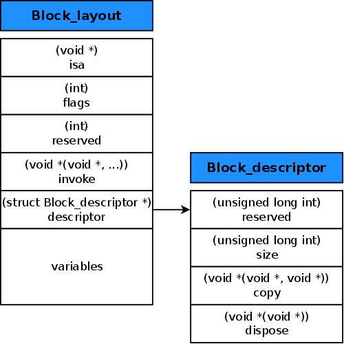

# Block源码解析
## 前言
&emsp;&emsp;之前写过一篇block的文章，参考的源码是libclosure-38的，跟libclosure-67有所区别，且由于之前理解不足文章有些细小错误，决定重新写一篇。  
&emsp;&emsp;关于Block的文章各个博客各个论坛都已经数不胜数，每一篇都有自己独特的特点和见解。但很多文章深度不够，只是简单的把一些源码放上去，并未分析每一步操作的作用，比较不友好，只能看得一知半解。笔者刚看的时候也是一头雾水，花费了很长时间查阅了各种资料才渐渐理解。鉴于此，决定写一篇事无巨细的文章来剖析Block的每一个步骤，来帮助大家理解Block的奥秘。  
&emsp;&emsp;Block的使用这里就不再做过多解释，下面会通过分析源码来讲解Block的实现、变量的捕获以及__block的作用等。
## Block
### Block类型
&emsp;&emsp;看一段代码，以下在ARC下执行。  
``` objectivec
int main(int argc, const char * argv[]) {
    @autoreleasepool {
       int num = 1;
       static int staticNum = 2;
       char str[] = "hello";
       void(^aBlock)(void) = ^(void) {
           printf("%d\n", num);
       };
       void(^bBlock)(void) = ^(void) {
          printf("%d\n", staticNum);
       };
       void(^cBlock)(char *) = ^(char *word) {
           printf("%s\n", word);
       };
       aBlock();
       bBlock();
       cBlock(str);
       NSLog(@"%@----%@----%@----%@", aBlock, bBlock, cBlock, ^{NSLog(@"%d", num);});
    }
    return 0;
}
```
打印结果如下:
```
<__NSMallocBlock__: 0x100607950>----<__NSGlobalBlock__: 0x100002118>--
--<__NSGlobalBlock__: 0x100002158>----<__NSStackBlock__: 0x7fff5fbff5c0>
```
&emsp;&emsp;其中因为bBlock和cBlock只使用了静态变量和入参，不需要捕获外部变量，所以为全局Block ```__NSGlobalBlock__ ```，存在于全局区，内存在程序结束后由系统回收。最后一个使用了外部变量num，为栈Block```__NSStackBlock__ ```，内存由编译器控制，过了作用域就会被回收。而aBlock虽然也只使用了外部变量，但由于在ARC下会自动调用一次copy方法，将Block从栈区copy到堆区，所以aBlock为堆Block```__NSMallocBlock__ ```，内存由ARC控制，没有强指针指向时释放。而在MRC中，赋值不会执行copy操作，所以aBlock依然会存在于栈中，所以在MRC中一般都需要执行copy，否则很容易造成crash。  
&emsp;&emsp;在ARC中，当Block作为属性被strong、copy修饰或被強指针应用或作为返回值时，都会默认执行copy方法。而MRC中，只有被copy修饰时，Block才会执行copy。所以MRC中Block都需要用copy来修饰，而在ARC中用copy修饰只是沿用了MRC的习惯，此时用copy和strong效果是相同的。下面会讲到copy的具体实现。
### Block数据结构定义
&emsp;&emsp;Block的定义在```Block_private.h```中，[点击查看源码](https://opensource.apple.com/source/libclosure/libclosure-67)。
``` objectivec
// Values for Block_layout->flags to describe block objects
enum {
    BLOCK_DEALLOCATING =      (0x0001),  // runtime  
    BLOCK_REFCOUNT_MASK =     (0xfffe),  // runtime 
    BLOCK_NEEDS_FREE =        (1 << 24), // runtime 
    BLOCK_HAS_COPY_DISPOSE =  (1 << 25), // compiler 
    BLOCK_HAS_CTOR =          (1 << 26), // compiler: helpers have C++ code
    BLOCK_IS_GC =             (1 << 27), // runtime 
    BLOCK_IS_GLOBAL =         (1 << 28), // compiler 
    BLOCK_USE_STRET =         (1 << 29), // compiler: undefined if !BLOCK_HAS_SIGNATURE
    BLOCK_HAS_SIGNATURE  =    (1 << 30), // compiler 
    BLOCK_HAS_EXTENDED_LAYOUT=(1 << 31)  // compiler 
};

#define BLOCK_DESCRIPTOR_1 1
struct Block_descriptor_1 {
    uintptr_t reserved;
    uintptr_t size;
};

#define BLOCK_DESCRIPTOR_2 1
struct Block_descriptor_2 {
    // requires BLOCK_HAS_COPY_DISPOSE
    void (*copy)(void *dst, const void *src);
    void (*dispose)(const void *);
};

#define BLOCK_DESCRIPTOR_3 1
struct Block_descriptor_3 {
    // requires BLOCK_HAS_SIGNATURE
    const char *signature;
    const char *layout;     // contents depend on BLOCK_HAS_EXTENDED_LAYOUT
};

struct Block_layout {
    void *isa;
    volatile int32_t flags; // contains ref count
    int32_t reserved; 
    void (*invoke)(void *, ...);
    struct Block_descriptor_1 *descriptor;
    // imported variables
};
```
&emsp;&emsp;用一张被用烂的图，[点击查看原文](http://www.galloway.me.uk/2013/05/a-look-inside-blocks-episode-3-block-copy/)。  
  
&emsp;&emsp;事实上该图适用于libclosure-38，在最新的源码中结构已经有所改变，但整体并未改变，只是在基础上新增了```signature ```和```layout ```，依然可以用其来理解。  
* isa指针
指向父类的结构体，就是```_NSConcreteStackBlock```，```_NSConcreteMallocBlock```，```_NSConcreteGlobalBlock```这几个，说明OC本身也是一个对象。
* flags
就是上面那几个枚举，用来保留block的一些信息，用到的如下：
``` objectivec
enum {
    BLOCK_DEALLOCATING =      (0x0001),  // runtime  
    BLOCK_REFCOUNT_MASK =     (0xfffe),  // runtime 用来标识栈Block
    BLOCK_NEEDS_FREE =        (1 << 24), // runtime  用来标识堆Block
    BLOCK_HAS_COPY_DISPOSE =  (1 << 25), // compiler compiler 含有copy_dispose助手
    BLOCK_IS_GLOBAL =         (1 << 28), // compiler 是否为全局Block
};
```
BLOCK_REFCOUNT_MASK、BLOCK_IS_GLOBAL和BLOCK_NEEDS_FREE用来标识Block类型，BLOCK_HAS_COPY_DISPOSE判断Block是否有copy_dispose助手，即description2中的copy和dispose函数，用来管理捕获对象的内存，下面会细讲。
* reserved
保留信息
* invoke
函数指针，指向block具体的执行函数
* description
block附加描述信息，主要保存了内存size以及copy和dispose函数的指针及签名和layout等信息，通过源码可发现，layout中只包含了Block_descriptor_1，并未包含Block_descriptor_2和Block_descriptor_3，这是因为在捕获不同类型变量或者没用到外部变量时，编译器会改变结构体的结构，按需添加Block_descriptor_2和Block_descriptor_3，所以才需要BLOCK_HAS_COPY_DISPOSE和BLOCK_HAS_SIGNATURE等枚举来判断
* variables capture的外部变量，如果Block中使用了外部变量，结构体中就会有相应的信息，下面会解释。Block将使用的变量或者变量指针copy过来，内部才可以访问。
###Block_byref的结构定义
&emsp;&emsp;上面介绍了Block也就是```Block_layout ```的源码，```Block_private.h```中还有定义了一个结构体```Block_byref ```，变量在被__block修饰时由编译器来生成，结构如下：
``` objectivec
enum {
    // Byref refcount must use the same bits as Block_layout's refcount.
    // BLOCK_DEALLOCATING =      (0x0001),  // runtime
    // BLOCK_REFCOUNT_MASK =     (0xfffe),  // runtime

    BLOCK_BYREF_LAYOUT_MASK =       (0xf << 28), // compiler
    BLOCK_BYREF_LAYOUT_EXTENDED =   (  1 << 28), // compiler
    BLOCK_BYREF_LAYOUT_NON_OBJECT = (  2 << 28), // compiler
    BLOCK_BYREF_LAYOUT_STRONG =     (  3 << 28), // compiler
    BLOCK_BYREF_LAYOUT_WEAK =       (  4 << 28), // compiler
    BLOCK_BYREF_LAYOUT_UNRETAINED = (  5 << 28), // compiler

    BLOCK_BYREF_IS_GC =             (  1 << 27), // runtime

    BLOCK_BYREF_HAS_COPY_DISPOSE =  (  1 << 25), // compiler
    BLOCK_BYREF_NEEDS_FREE =        (  1 << 24), // runtime
};

struct Block_byref {
    void *isa;
    struct Block_byref *forwarding;
    volatile int32_t flags; // contains ref count
    uint32_t size;
};

struct Block_byref_2 {
    // requires BLOCK_BYREF_HAS_COPY_DISPOSE
    void (*byref_keep)(struct Block_byref *dst, struct Block_byref *src);
    void (*byref_destroy)(struct Block_byref *);
};

struct Block_byref_3 {
    // requires BLOCK_BYREF_LAYOUT_EXTENDED
    const char *layout;
};
```
&emsp;&emsp;当其结构与```Block_layout```结构类似
* isa指针 
指向父类，一般直接指向0，后面会说。
* forwarding指针
在栈中指向自己，Block执行copy后指向堆中的byref。
* flags
runtime中用到的如下：
```
    BLOCK_BYREF_LAYOUT_EXTENDED =   (  1 << 28), // compiler
    BLOCK_BYREF_HAS_COPY_DISPOSE =  (  1 << 25), // compiler
    BLOCK_BYREF_NEEDS_FREE =        (  1 << 24), // runtime
```
BLOCK_BYREF_LAYOUT_EXTENDED表示含有layout，BLOCK_BYREF_HAS_COPY_DISPOSE表示byref中含有copy_dispose函数，在__block捕获的变量为对象时就会生成copy_dispose函数用来管理对象内存，BLOCK_BYREF_NEEDS_FREE判断是否要释放。
* size 
所占内存大小
* Block_byref_2、Block_byref_3
Block_byref_2和Block_byref_3用来保存附加信息
###_NSConcreteGlobalBlock的实现
&emsp;&emsp;使用Clang可以将OC转成C++，就可以看到Block具体做了什么。clang -rewrite-objc filename，比如我需要转换main.m中的代码就可以写clang -rewrite-objc main.m，注意路径正确。转换后的.cpp文件有10万行，只需要看最后几行。  
&emsp;&emsp;上面说到，在block内部不使用外部变量或者为静态或者全局变量时，该block就是```_NSConcreteGlobalBlock ```，看下编译后的结果。
``` objectivec
int main(int argc, const char * argv[]) {
    @autoreleasepool {
        // insert code here...
        ^{
            printf("hello block");
        }();
        
    }
    return 0;
}
```
Clang后
``` objectivec
struct __block_impl {
  void *isa;
  int Flags;
  int Reserved;
  void *FuncPtr;
};
//下面为转换后的代码
struct __main_block_impl_0 {
  struct __block_impl impl;
  struct __main_block_desc_0* Desc;
  __main_block_impl_0(void *fp, struct __main_block_desc_0 *desc, int flags=0) {
    impl.isa = &_NSConcreteStackBlock;
    impl.Flags = flags;
    impl.FuncPtr = fp;
    Desc = desc;
  }
};
static void __main_block_func_0(struct __main_block_impl_0 *__cself) {

    printf("hello block");
        }

static struct __main_block_desc_0 {
  size_t reserved;
  size_t Block_size;
} __main_block_desc_0_DATA = { 0, sizeof(struct __main_block_impl_0)};
int main(int argc, const char * argv[]) {
    /* @autoreleasepool */ { __AtAutoreleasePool __autoreleasepool; 

        ((void (*)())&__main_block_impl_0((void *)__main_block_func_0, &__main_block_desc_0_DATA))();

    }
    return 0;
}
```
&emsp;&emsp;从上可以看到，```__block_impl```、```__main_block_impl_0```以及```__main_block_desc_0```这三个结构体一起组成了整个Block，生成的结构体各个参数跟上面介绍的一致。编译器将Block内的函数定义成一个独立的函数```__main_block_func_0```，在最后调用。  
&emsp;&emsp;不过有两点问题：  
* 1、该Block并未使用外部变量，应该是一个_NSConcreteGlobalBlock，而用clang显示的却是_NSConcreteStackBlock，唐巧的说法是：clang 改写的具体实现方式和 LLVM 不太一样。这点不是很清楚，如果有了解的可以释疑一下。
* 2、把编译后的代码copy到mm中后，```((void (*)())&__main_block_impl_0((void *)__main_block_func_0, &__main_block_desc_0_DATA))();```此行会crash，因为```((void (*)())&__main_block_impl_0((void *)__main_block_func_0, &__main_block_desc_0_DATA))```指向的是impl的isa，也就是_NSConcreteStackBlock的指针。需要改写成```struct __main_block_impl_0 impl_0 = __main_block_impl_0((void *)__main_block_func_0, &__main_block_desc_0_DATA); ((void (*)())(impl_0.impl.FuncPtr))();```才能执行成功。或许clang改写的实现跟LLVM确实不一样吧。
###_NSConcreteStackBlock的实现
&emsp;&emsp;如果block内部使用了普通的外部变量，就是```_NSConcreteStackBlock```。  
``` objectivec
int main(int argc, const char * argv[]) {
    @autoreleasepool {
        // insert code here...

        int a = 1;
        NSObject *obj = [[NSObject alloc] init];
        ^{
            obj, a;
        };
    }
    return 0;
}
```
Clang后
``` objectivec
struct __block_impl {
  void *isa;
  int Flags;
  int Reserved;
  void *FuncPtr;
};
//
struct __main_block_impl_0 {
  struct __block_impl impl;
  struct __main_block_desc_0* Desc;
  NSObject *obj;
  int a;
  __main_block_impl_0(void *fp, struct __main_block_desc_0 *desc, NSObject *_obj, int _a, int flags=0) : obj(_obj), a(_a) {
    impl.isa = &_NSConcreteStackBlock;
    impl.Flags = flags;
    impl.FuncPtr = fp;
    Desc = desc;
  }
};
static void __main_block_func_0(struct __main_block_impl_0 *__cself) {
  NSObject *obj = __cself->obj; // bound by copy
  int a = __cself->a; // bound by copy

            obj, a;
        }
static void __main_block_copy_0(struct __main_block_impl_0*dst, struct __main_block_impl_0*src) {_Block_object_assign((void*)&dst->obj, (void*)src->obj, 3/*BLOCK_FIELD_IS_OBJECT*/);}

static void __main_block_dispose_0(struct __main_block_impl_0*src) {_Block_object_dispose((void*)src->obj, 3/*BLOCK_FIELD_IS_OBJECT*/);}

static struct __main_block_desc_0 {
  size_t reserved;
  size_t Block_size;
  void (*copy)(struct __main_block_impl_0*, struct __main_block_impl_0*);
  void (*dispose)(struct __main_block_impl_0*);
} __main_block_desc_0_DATA = { 0, sizeof(struct __main_block_impl_0), __main_block_copy_0, __main_block_dispose_0};
int main(int argc, const char * argv[]) {
    /* @autoreleasepool */ { __AtAutoreleasePool __autoreleasepool; 
        int a = 1;
        NSObject *obj = ((NSObject *(*)(id, SEL))(void *)objc_msgSend)((id)((NSObject *(*)(id, SEL))(void *)objc_msgSend)((id)objc_getClass("NSObject"), sel_registerName("alloc")), sel_registerName("init"));
        ((void (*)())&__main_block_impl_0((void *)__main_block_func_0, &__main_block_desc_0_DATA, obj, a, 570425344));
    }
    return 0;
}
```
&emsp;&emsp;该例在Block中同时使用了普通变量和实例变量，Block在捕获外部变量的操作基本一致，都是在生成结构体的时候将所有Block里用到的外部变量作为属性存起来。这就是为什么在self.block里调用self会造成循环引用，因为Block捕获了self并把self当做一个值保存了起来。  
&emsp;&emsp;而且如果此时在Block里面改变a的值是会报错，因为普通变量的值传递为复制，所有Block里的a只是copy过去的a的值，在Block里改变a的值也不会影响外面，编译器避免这个错误就报错。同样的，捕获对象时也是对指针的copy，生成一个指针指向obj对象，所以如果在Block中直接让obj指针指向另外一个对象也会报错。这点编译器已经加了注释// bound by copy。  
&emsp;&emsp;同时，该例与上例有所区别，多了```__main_block_copy_0```和```__main_block_dispose_0```这两个函数，并在描述```__main_block_desc_0```结构体中保存了这两个函数指针。这就是上面所说的copy_dispose助手，C语言结构体中，编译器很难处理对象的初始化和销毁操作，所以使用runtime来管理相关内存。```BLOCK_FIELD_IS_OBJECT```是在捕获对象时添加的特别标识，此时是3，下面会细讲。  
&emsp;&emsp;此Block是为栈Block```_NSConcreteStackBlock```，不过在ARC中，因为赋值给aBlock，会执行一次copy，将其中栈中copy到堆中，所以在MRC中aBlock为```_NSConcreteStackBlock```，在ARC中就是```_NSConcreteMallocBlock```。
###_NSConcreteMallocBlock && Block_copy()  
&emsp;&emsp;上面说到，ARC中生成的```_NSConcreteStackBlock```在赋值给强指针时会默认执行一次copy变成```_NSConcreteMallocBlock```，下面介绍下copy的实现。  
&emsp;&emsp;在```Block.h```中定义了Block_copy的宏
``` objectivec
#define Block_copy(...) ((__typeof(__VA_ARGS__))_Block_copy((const void *)(__VA_ARGS__)))
```
&emsp;&emsp;其实现在```runtime.h```中
``` objectivec
void *_Block_copy(const void *arg) {
    //1、
    struct Block_layout *aBlock;

    if (!arg) return NULL;
    
    //2、
    // The following would be better done as a switch statement
    aBlock = (struct Block_layout *)arg;
    //3、
    if (aBlock->flags & BLOCK_NEEDS_FREE) {
        // latches on high
        latching_incr_int(&aBlock->flags);
        return aBlock;
    }
    //4、
    else if (aBlock->flags & BLOCK_IS_GLOBAL) {
        return aBlock;
    }
    else {
        //5、
        // Its a stack block.  Make a copy.
        struct Block_layout *result = malloc(aBlock->descriptor->size);
        if (!result) return NULL;
        //6、
        memmove(result, aBlock, aBlock->descriptor->size); // bitcopy first
        // reset refcount
        //7、
        result->flags &= ~(BLOCK_REFCOUNT_MASK|BLOCK_DEALLOCATING);    // XXX not needed
        result->flags |= BLOCK_NEEDS_FREE | 2;  // logical refcount 1
        //8、
        _Block_call_copy_helper(result, aBlock);
        // Set isa last so memory analysis tools see a fully-initialized object.
        //9、
        result->isa = _NSConcreteMallocBlock;
        return result;
    }
}

static int32_t latching_incr_int(volatile int32_t *where) {
    while (1) {
        int32_t old_value = *where;
        if ((old_value & BLOCK_REFCOUNT_MASK) == BLOCK_REFCOUNT_MASK) {
            return BLOCK_REFCOUNT_MASK;
        }
        if (OSAtomicCompareAndSwapInt(old_value, old_value+2, where)) {
            return old_value+2;
        }
    }
}

static void _Block_call_copy_helper(void *result, struct Block_layout *aBlock)
{
    struct Block_descriptor_2 *desc = _Block_descriptor_2(aBlock);
    if (!desc) return;

    (*desc->copy)(result, aBlock); // do fixup
}

static struct Block_descriptor_2 * _Block_descriptor_2(struct Block_layout *aBlock)
{
    if (! (aBlock->flags & BLOCK_HAS_COPY_DISPOSE)) return NULL;
    uint8_t *desc = (uint8_t *)aBlock->descriptor;
    desc += sizeof(struct Block_descriptor_1);
    return (struct Block_descriptor_2 *)desc;
}
```
&emsp;&emsp;以上就是```_NSConcreteStackBlock```转换成```_NSConcreteMallocBlock```的过程，下面按步解释每一步的作用。  
* 1、先声明一个```Block_layout```结构体类型的指针，如果传入的Block为NULL就直接返回。
* 2、如果Block有值就强转成```Block_layout```的指针类型。
* 3、如果Block的flags表明该Block为堆Block时，就对其引用计数递增，然后返回原Block。```latching_incr_int```这个函数进行了一次死循环，如果flags含有```BLOCK_REFCOUNT_MASK```证明其引用计数达到最大，直接返回，需要三万多个指针指向，正常情况下不会出现。随后做一次原子性判断其值当前是否被其他线程改动，如果被改动就进入下一次循环直到改动结束后赋值。```OSAtomicCompareAndSwapInt ```的作用就是在```where```取值与```old_value ```相同时，将```old_value+2```赋给```where```。  注:Block的引用计数以flags的后16位代表，以 2为单位，每次递增2，1被```BLOCK_DEALLOCATING```正在释放占用。
* 4、如果Block为全局Block就不做其他处理直接返回。
* 5、该else中就是栈Block了，按原Block的内存大小分配一块相同大小的内存，如果失败就返回NULL。
* 6、memmove()用于复制位元，将aBlock的所有信息copy到result的位置上。
* 7、将新Block的引用计数置零。```BLOCK_REFCOUNT_MASK|BLOCK_DEALLOCATING```就是```0xffff```，```~(0xffff)```就是```0x0000```，```result->flags```与```0x0000```与等就将```result->flags```的后16位置零。然后将新Block标识为堆Block并将其引用计数置为2。
* 8、如果有copy_dispose助手，就执行Block的保存的copy函数，就是上面的```__main_block_copy_0```。在```_Block_descriptor_2```函数中，用```BLOCK_HAS_COPY_DISPOSE```来判断是否有```Block_descriptor_2```，且取Block的```Block_descriptor_2```时，因为有无是编译器确定的，在Block结构体中并无保留，所以需要使用指针相加的方式来确定其指针位置。有就执行，没有就return掉。
* 9、将堆Block的isa指针置为```_NSConcreteMallocBlock```，返回新Block，end。
&emsp;&emsp;因为在ARC中的赋值的自动copy，所以：
``` objectivec
        NSObject *obj = [[NSObject alloc] init];
        void(^aBlock)() = ^{
            obj;
        };
        NSLog(@"%ld", CFGetRetainCount((__bridge void *)obj));
```
&emsp;&emsp;其打印结果为3，因为Block在生成栈Block捕获外部变量的时候会生成一份指针指向obj，在将Block赋值给aBlock时从栈中copy到堆区中，又持有了一份。
### Block_release()
&emsp;&emsp;有```Block_copy()```就有对应的```Block_release()```，其在```Block.h ```中的定义如下：
``` objectivec
#define Block_release(...) _Block_release((const void *)(__VA_ARGS__))
```
&emsp;&emsp;其实现在```runtime.h```中
``` objectivec
void _Block_release(const void *arg) {
    //1、
    struct Block_layout *aBlock = (struct Block_layout *)arg;
    if (!aBlock) return;
    //2、
    if (aBlock->flags & BLOCK_IS_GLOBAL) return;
    //3、
    if (! (aBlock->flags & BLOCK_NEEDS_FREE)) return;
    //4、
    if (latching_decr_int_should_deallocate(&aBlock->flags)) {
        //5、
        _Block_call_dispose_helper(aBlock);
        //6、
        _Block_destructInstance(aBlock);
        //7、
        free(aBlock);
    }
}

static bool latching_decr_int_should_deallocate(volatile int32_t *where) {
    while (1) {
        int32_t old_value = *where;
        if ((old_value & BLOCK_REFCOUNT_MASK) == BLOCK_REFCOUNT_MASK) {
            return false; // latched high
        }
        if ((old_value & BLOCK_REFCOUNT_MASK) == 0) {
            return false;   // underflow, latch low
        }
        int32_t new_value = old_value - 2;
        bool result = false;
        if ((old_value & (BLOCK_REFCOUNT_MASK|BLOCK_DEALLOCATING)) == 2) {
            new_value = old_value - 1;
            result = true;
        }
        if (OSAtomicCompareAndSwapInt(old_value, new_value, where)) {
            return result;
        }
    }
}

static void _Block_call_dispose_helper(struct Block_layout *aBlock)
{
    struct Block_descriptor_2 *desc = _Block_descriptor_2(aBlock);
    if (!desc) return;

    (*desc->dispose)(aBlock);
}

static void _Block_destructInstance_default(const void *aBlock __unused) {}
static void (*_Block_destructInstance) (const void *aBlock) = _Block_destructInstance_default;

```
* 1、将入参arg强转成```(struct Block_layout *)```类型，如果入参为NULL则直接返回。
* 2、如果入参为全局Block则返回不做处理。
* 3、如果入参不为堆Block则返回不做处理。
* 4、判断aBlock的引用计数是否需要释放内存。与copy同样的，```latching_decr_int_should_deallocate```也做了一次循环和原子性判断保证原子性。如果该block的引用计数过高(0xfffe)或者过低(0)返回false不做处理。如果其引用计数为2，则将其引用计数-1即```BLOCK_DEALLOCATING```标明正在释放，返回true，如果大于2则将其引用计数-2并返回false。
* 5、如果步骤4标明了该block需要被释放，就进入步骤5。如果aBlock含有copy_dispose助手就执行aBlock中的dispose函数，与copy中的对应不再多做解释。
* 6、```_Block_destructInstance```默认没做其他操作，可见源码。
* 7、最后一步释放掉aBlock，end。
### __block的作用及实现
&emsp;&emsp;前面说到，Block捕获的变量不允许在内部改变指针指向，因为内部的对象是重新copy的一份指针或者普通变量值。如果需要改变普通变量的值或指针的指向，这个时候就需要用到__block。
``` objectivec
int main(int argc, const char * argv[]) {
    @autoreleasepool {
        // insert code here...
        __block int a = 1;
        __block NSObject *obj = [[NSObject alloc] init];
        ^{
            a++;
            obj;
        }();
    }
    return 0;
}
```
Clang后
``` objectivec
static void __Block_byref_id_object_copy_131(void *dst, void *src) {
 _Block_object_assign((char*)dst + 40, *(void * *) ((char*)src + 40), 131);
}
static void __Block_byref_id_object_dispose_131(void *src) {
 _Block_object_dispose(*(void * *) ((char*)src + 40), 131);
}

struct __Block_byref_a_0 {
  void *__isa;
__Block_byref_a_0 *__forwarding;
 int __flags;
 int __size;
 int a;
};
struct __Block_byref_obj_1 {
  void *__isa;
__Block_byref_obj_1 *__forwarding;
 int __flags;
 int __size;
 void (*__Block_byref_id_object_copy)(void*, void*);
 void (*__Block_byref_id_object_dispose)(void*);
 NSObject *obj;
};

struct __main_block_impl_0 {
  struct __block_impl impl;
  struct __main_block_desc_0* Desc;
  __Block_byref_a_0 *a; // by ref
  __Block_byref_obj_1 *obj; // by ref
  __main_block_impl_0(void *fp, struct __main_block_desc_0 *desc, __Block_byref_a_0 *_a, __Block_byref_obj_1 *_obj, int flags=0) : a(_a->__forwarding), obj(_obj->__forwarding) {
    impl.isa = &_NSConcreteStackBlock;
    impl.Flags = flags;
    impl.FuncPtr = fp;
    Desc = desc;
  }
};
static void __main_block_func_0(struct __main_block_impl_0 *__cself) {
  __Block_byref_a_0 *a = __cself->a; // bound by ref
  __Block_byref_obj_1 *obj = __cself->obj; // bound by ref

            (a->__forwarding->a)++;
            (obj->__forwarding->obj);
        }
static void __main_block_copy_0(struct __main_block_impl_0*dst, struct __main_block_impl_0*src) {_Block_object_assign((void*)&dst->a, (void*)src->a, 8/*BLOCK_FIELD_IS_BYREF*/);_Block_object_assign((void*)&dst->obj, (void*)src->obj, 8/*BLOCK_FIELD_IS_BYREF*/);}

static void __main_block_dispose_0(struct __main_block_impl_0*src) {_Block_object_dispose((void*)src->a, 8/*BLOCK_FIELD_IS_BYREF*/);_Block_object_dispose((void*)src->obj, 8/*BLOCK_FIELD_IS_BYREF*/);}

static struct __main_block_desc_0 {
  size_t reserved;
  size_t Block_size;
  void (*copy)(struct __main_block_impl_0*, struct __main_block_impl_0*);
  void (*dispose)(struct __main_block_impl_0*);
} __main_block_desc_0_DATA = { 0, sizeof(struct __main_block_impl_0), __main_block_copy_0, __main_block_dispose_0};
int main(int argc, const char * argv[]) {
    /* @autoreleasepool */ { __AtAutoreleasePool __autoreleasepool; 
        __attribute__((__blocks__(byref))) __Block_byref_a_0 a = {(void*)0,(__Block_byref_a_0 *)&a, 0, sizeof(__Block_byref_a_0), 1};
        __attribute__((__blocks__(byref))) __Block_byref_obj_1 obj = {(void*)0,(__Block_byref_obj_1 *)&obj, 33554432, sizeof(__Block_byref_obj_1), __Block_byref_id_object_copy_131, __Block_byref_id_object_dispose_131, ((NSObject *(*)(id, SEL))(void *)objc_msgSend)((id)((NSObject *(*)(id, SEL))(void *)objc_msgSend)((id)objc_getClass("NSObject"), sel_registerName("alloc")), sel_registerName("init"))};
        ((void (*)())&__main_block_impl_0((void *)__main_block_func_0, &__main_block_desc_0_DATA, (__Block_byref_a_0 *)&a, (__Block_byref_obj_1 *)&obj, 570425344))();
    }
    return 0;
}
```
&emsp;&emsp;可以看到加了__block的a和obj已经被编译成了两个结构体```__Block_byref_a_0```和```__Block_byref_obj_1```，这两个就是上面所说的```Block_byref```。可以看到起结构大同小异，都有__isa指针指向0，__forwarding指针指向自己，__flags用来标记，__size用来保存内存大小，a和obj指向最初的变量。可以发现，对象的结构体多了两个方法用来处理obj的内存。注释也变成了// bound by ref，这时候就可以修改变量a和对指针obj重新赋值。对象结构体比普通变量多了两个函数，用来处理NSOject的内存。  
&emsp;&emsp;上面说Block捕获的对象会持有该对象，使其引用计数增加，然后看下__block修饰的对象会怎样。
``` objectivec
    __block NSObject *obj = [[NSObject alloc] init];
    NSLog(@"%ld---%p---%p", CFGetRetainCount((__bridge void *)obj), obj, &obj);
    ^{
        NSLog(@"%ld---%p---%p", CFGetRetainCount((__bridge void *)obj), obj, &obj);
    }();
    NSLog(@"%ld---%p---%p", CFGetRetainCount((__bridge void *)obj), obj, &obj);
```
打印结果如下:
``` objectivec
1---0x60c000007d50---0x7fff5e913c28
1---0x60c000007d50---0x7fff5e913c28
1---0x60c000007d50---0x7fff5e913c28
```
&emsp;&emsp;可以看到，在栈Block中，自始只有强指针指向obj，就是__block生成的结构体。  
&emsp;&emsp;然后看下在copy到堆中的效果：
``` objectivec
__block NSObject *obj = [[NSObject alloc] init];
    NSLog(@"%ld---%p---%p", CFGetRetainCount((__bridge void *)obj), obj, &obj);
    void(^aBlock)() = ^{
        NSLog(@"%ld---%p---%p", CFGetRetainCount((__bridge void *)obj), obj, &obj);
    };
    aBlock();
    NSLog(@"%ld---%p---%p", CFGetRetainCount((__bridge void *)obj), obj, &obj);
```
结果如下：
``` objectivec
1---0x604000012ca0---0x7fff50631c28
1---0x604000012ca0---0x600000058c28
1---0x604000012ca0---0x600000058c28
```
&emsp;&emsp;可以看到，obj的内存地址一直在栈中，而执行了BlockCopy后，obj指针的地址从栈变到了堆中，而obj的引用计数一直是1。在copy操作之后，结构体obj也被复制到了堆中，并断开栈中的obj结构体对obj对象的指向。那如果这个时候取栈中的obj不就有问题了？__forwarding就派上用场了，上面编译的结果发现，结构体对象在使用obj的时候会使用obj->__forwarding->obj，如果所有__forwarding都指向自己，这一步还有什么意义？栈Block在执行copy操作后，栈obj结构体的__forwarding就会指向copy到堆中的obj结构体。此时再取值，操作的就是同一份指针了。证明如下:
``` objectivec
        __block NSObject *obj = [[NSObject alloc] init];
        NSLog(@"%ld---%p---%p", CFGetRetainCount((__bridge void *)obj), obj, &obj);
        void(^aBlock)() = ^{
            NSLog(@"%ld---%p---%p", CFGetRetainCount((__bridge void *)obj), obj, &obj);
        };
        aBlock();
        void(^bBlock)() = [aBlock copy];
        bBlock();
        aBlock();
        NSLog(@"%ld---%p---%p", CFGetRetainCount((__bridge void *)obj), obj, &obj);
```
注：该段在MRC下执行，否则栈Block赋值给aBlock就会默认执行copy操作变成堆block。
打印结果：
``` objectivec
1---0x1006229d0---0x7fff5fbff6b8
1---0x1006229d0---0x7fff5fbff6b8
1---0x1006229d0---0x100508c98
1---0x1006229d0---0x100508c98
1---0x1006229d0---0x100508c98
```
&emsp;&emsp;由上可知，在copy之前，aBlock的打印结果都是初始化生成的指针，而copy之后打印就和bBlock的打印结果相同了。总结一下就是，在栈中的obj结构体__forwarding指向的就是栈中的自己，执行copy之后，会在堆中生成一份obj结构体并断开栈中对obj的引用，此时堆中的obj结构体__forwarding就指向自己，而栈中的__forwarding就指向堆中的obj结构体。下面也会通过分析源码来具体解释。
### _Block_object_assign
&emsp;&emsp;虽然上面已经讲了很多，但细心的同学可以发现，在Clang后的代码中还有两个没有讲到，就是编译器生成的copy_dispose代码中调用的两个用来管理对象内存的函数```_Block_object_assign```和```_Block_object_dispose```。  
&emsp;&emsp;然后先讲```_Block_object_assign```。大家可以在```Block.h```中看到：
``` objectivec
BLOCK_EXPORT void _Block_object_assign(void *, const void *, const int)
    __OSX_AVAILABLE_STARTING(__MAC_10_6, __IPHONE_3_2);
```
&emsp;&emsp;其实现在```runtime.c```中，其中用到很多枚举，如果不懂其含义，很难理解其上面的代码，所以在此之前先解释下各种枚举所代表的意思。  
&emsp;&emsp;其枚举定义在```Block_private.h```中：
``` objectivec
// Values for _Block_object_assign() and _Block_object_dispose() parameters
enum {
    // see function implementation for a more complete description of these fields and combinations
    BLOCK_FIELD_IS_OBJECT   =  3,  // id, NSObject, __attribute__((NSObject)), block, ...
    BLOCK_FIELD_IS_BLOCK    =  7,  // a block variable
    BLOCK_FIELD_IS_BYREF    =  8,  // the on stack structure holding the __block variable
    BLOCK_FIELD_IS_WEAK     = 16,  // declared __weak, only used in byref copy helpers
    BLOCK_BYREF_CALLER      = 128, // called from __block (byref) copy/dispose support routines.
};

enum {
    BLOCK_ALL_COPY_DISPOSE_FLAGS = 
        BLOCK_FIELD_IS_OBJECT | BLOCK_FIELD_IS_BLOCK | BLOCK_FIELD_IS_BYREF |
        BLOCK_FIELD_IS_WEAK | BLOCK_BYREF_CALLER
};
```
* ```BLOCK_FIELD_IS_OBJECT```OC对象类型;
* ```BLOCK_FIELD_IS_BLOCK```为另一个block；
* ```BLOCK_FIELD_IS_BYREF```为一个被__block修饰后生成的结构体；
* ```BLOCK_FIELD_IS_WEAK```被__weak修饰过的弱引用，只在```Block_byref```管理内部对象内存时使用，也就是```__block __weak id``` ；
* ```BLOCK_BYREF_CALLER```在处理```Block_byref```内部对象内存的时候会加的一个额外标记，配合上面的枚举一起使用；
* ```BLOCK_ALL_COPY_DISPOSE_FLAGS```上述情况的整合，即以上都会包含copy_dispose助手。
&emsp;&emsp;现在再看```_Block_object_assign ```:
``` objectivec
void _Block_object_assign(void *destArg, const void *object, const int flags) {
    const void **dest = (const void **)destArg;
    switch (os_assumes(flags & BLOCK_ALL_COPY_DISPOSE_FLAGS)) {
      case BLOCK_FIELD_IS_OBJECT:
        /*******
        id object = ...;
        [^{ object; } copy];
        ********/
        //1.
        _Block_retain_object(object);
        *dest = object;
        break;

      case BLOCK_FIELD_IS_BLOCK:
        /*******
        void (^object)(void) = ...;
        [^{ object; } copy];
        ********/
        //2.
        *dest = _Block_copy(object);
        break;
    
      case BLOCK_FIELD_IS_BYREF | BLOCK_FIELD_IS_WEAK:
      case BLOCK_FIELD_IS_BYREF:
        /*******
         // copy the onstack __block container to the heap
         // Note this __weak is old GC-weak/MRC-unretained.
         // ARC-style __weak is handled by the copy helper directly.
         __block ... x;
         __weak __block ... x;
         [^{ x; } copy];
         ********/
        //3.
        *dest = _Block_byref_copy(object);
        break;
        
      case BLOCK_BYREF_CALLER | BLOCK_FIELD_IS_OBJECT:
      case BLOCK_BYREF_CALLER | BLOCK_FIELD_IS_BLOCK:
        /*******
         // copy the actual field held in the __block container
         // Note this is MRC unretained __block only. 
         // ARC retained __block is handled by the copy helper directly.
         __block id object;
         __block void (^object)(void);
         [^{ object; } copy];
         ********/
        //4.
        *dest = object;
        break;

      case BLOCK_BYREF_CALLER | BLOCK_FIELD_IS_OBJECT | BLOCK_FIELD_IS_WEAK:
      case BLOCK_BYREF_CALLER | BLOCK_FIELD_IS_BLOCK  | BLOCK_FIELD_IS_WEAK:
        /*******
         // copy the actual field held in the __block container
         // Note this __weak is old GC-weak/MRC-unretained.
         // ARC-style __weak is handled by the copy helper directly.
         __weak __block id object;
         __weak __block void (^object)(void);
         [^{ object; } copy];
         ********/
        //5.
        *dest = object;
        break;

      default:
        break;
    }
}
static void _Block_retain_object_default(const void *ptr __unused) { }
static void (*_Block_retain_object)(const void *ptr) = _Block_retain_object_default;

static struct Block_byref *_Block_byref_copy(const void *arg) {
    //3.1
    struct Block_byref *src = (struct Block_byref *)arg;

    if ((src->forwarding->flags & BLOCK_REFCOUNT_MASK) == 0) {
        // src points to stack
        //3.2
        struct Block_byref *copy = (struct Block_byref *)malloc(src->size);
        copy->isa = NULL;
        // byref value 4 is logical refcount of 2: one for caller, one for stack
        //3.3
        copy->flags = src->flags | BLOCK_BYREF_NEEDS_FREE | 4;
        //3.4
        copy->forwarding = copy; // patch heap copy to point to itself
        src->forwarding = copy;  // patch stack to point to heap copy
        //3.5
        copy->size = src->size;

        if (src->flags & BLOCK_BYREF_HAS_COPY_DISPOSE) {
            // Trust copy helper to copy everything of interest
            // If more than one field shows up in a byref block this is wrong XXX
            //3.6
            struct Block_byref_2 *src2 = (struct Block_byref_2 *)(src+1);
            struct Block_byref_2 *copy2 = (struct Block_byref_2 *)(copy+1);
            //3.7
            copy2->byref_keep = src2->byref_keep;
            copy2->byref_destroy = src2->byref_destroy;

            if (src->flags & BLOCK_BYREF_LAYOUT_EXTENDED) {
                //3.8
                struct Block_byref_3 *src3 = (struct Block_byref_3 *)(src2+1);
                struct Block_byref_3 *copy3 = (struct Block_byref_3*)(copy2+1);
                copy3->layout = src3->layout;
            }
            //3.9
            (*src2->byref_keep)(copy, src);
        }
        else {
            // Bitwise copy.
            // This copy includes Block_byref_3, if any.
            //3.10
            memmove(copy+1, src+1, src->size - sizeof(*src));
        }
    }
    // already copied to heap
    else if ((src->forwarding->flags & BLOCK_BYREF_NEEDS_FREE) == BLOCK_BYREF_NEEDS_FREE) {
        //3.11
        latching_incr_int(&src->forwarding->flags);
    }
    //3.12
    return src->forwarding;
}

```
&emsp;&emsp;destArg为执行```Block_copy()```后的block中的对象、block、或者BYREF指针的指针，obj为copy之前的变量指针。
* 1、当block捕获的变量为OC对象时执行此步，ARC中引用计数由强指针来确定，所以```_Block_retain_object```默认是不做任何操作，只进行简单的指针赋值。
* 2、当block捕获的变量为另外一个block时执行此步，copy一个新的block并赋值。
* 3、当block捕获的变量为__block修饰的变量时会执行此步，执行byref_copy操作。
3.1、强转入参为```(struct Block_byref *)```类型。
3.2、当入参为栈byref时执行此步。分配一份与当前byref相同的内存，并将isa指针置为NULL。
3.3、将新byref的引用计数置为4并标记为堆，一份为调用方、一份为栈持有，所以引用计数为4。
3.4、然后将当前byref和malloc的byref的forwading都指向堆byref，然后操作堆栈都是同一份东西。
3.5、最后将size赋值
3.6、如果byref含有需要内存管理的变量即有copy_dispose助手，执行此步。分别取出src的```Block_byref_2```和copy的```Block_byref_2```。
3.7、将src的管理内存函数指针赋值给copy。
3.8、如果src含有```Block_byref_3```，则将src的```Block_byref_3```赋值给copy。
3.9、执行byref的```byref_keep```函数(即```_Block_object_assign```，不过会加上```BLOCK_BYREF_CALLER```标记)，管理捕获的对象内存。
3.10、如果捕获的是普通变量，就没有```Block_byref_2```，copy+1和src+1指向的就是```Block_byref_3```，执行字节拷贝。
3.11、如果该byref是存在于堆，则只需要增加其引用计数。
3.12、返回forwarding。
* 4、如果管理的是__block修饰的对象或者block的内存会执行此步，直接进行指针赋值。
* 5、同时被__weak和__block修饰的对象或者block执行此步，也是直接进行指针赋值。
### _Block_object_dispose
&emsp;&emsp;与```_Block_object_assign```对应的。
``` objectivec
void _Block_object_dispose(const void *object, const int flags) {
    switch (os_assumes(flags & BLOCK_ALL_COPY_DISPOSE_FLAGS)) {
      case BLOCK_FIELD_IS_BYREF | BLOCK_FIELD_IS_WEAK:
      case BLOCK_FIELD_IS_BYREF:
        // get rid of the __block data structure held in a Block
        //1.
        _Block_byref_release(object);
        break;
      case BLOCK_FIELD_IS_BLOCK:
        //2.
        _Block_release(object);
        break;
      case BLOCK_FIELD_IS_OBJECT:
        //3.
        _Block_release_object(object);
        break;
      //4.
      case BLOCK_BYREF_CALLER | BLOCK_FIELD_IS_OBJECT:
      case BLOCK_BYREF_CALLER | BLOCK_FIELD_IS_BLOCK:
      case BLOCK_BYREF_CALLER | BLOCK_FIELD_IS_OBJECT | BLOCK_FIELD_IS_WEAK:
      case BLOCK_BYREF_CALLER | BLOCK_FIELD_IS_BLOCK  | BLOCK_FIELD_IS_WEAK:
        break;
      default:
        break;
    }
}

static void _Block_byref_release(const void *arg) {
    //1.1
    struct Block_byref *byref = (struct Block_byref *)arg;

    // dereference the forwarding pointer since the compiler isn't doing this anymore (ever?)
    byref = byref->forwarding;
    
    if (byref->flags & BLOCK_BYREF_NEEDS_FREE) {
        //1.2
        int32_t refcount = byref->flags & BLOCK_REFCOUNT_MASK;
        os_assert(refcount);

        if (latching_decr_int_should_deallocate(&byref->flags)) {
            //1.3
            if (byref->flags & BLOCK_BYREF_HAS_COPY_DISPOSE) {
                //1.4
                struct Block_byref_2 *byref2 = (struct Block_byref_2 *)(byref+1);
                (*byref2->byref_destroy)(byref);
            }
            //1.5
            free(byref);
        }
    }
}

static void _Block_release_object_default(const void *ptr __unused) { }
static void (*_Block_release_object)(const void *ptr) = _Block_release_object_default;
```
* 1、如果需要管理的变量为byref，则执行该步。
1.1、将入参强转成```(struct Block_byref *)```，并将入参替换成forwarding。
1.2、如果该byref在堆上执行此步，如果该byref还被标记为栈则执行断言。
1.3、此函数上面有讲就不多提，判断是否需要释放内存。
1.4、如果有copy_dispose助手就执行byref_destroy管理捕获的变量内存。
1.5、释放byref。
* 2、如果block则调用```_Block_release```释放block，上面有讲。
* 3、如果是OC对象就进行release，默认没有做操作，由ARC管理。
* 4、如果是其他就不做处理，__block修饰的变量只有一个强指针引用。
## 测试
&emsp;&emsp;如果这么长都看完了，想必你已经对block有了深刻的认识，来波测试吧(本文只有此测试是抄的)。下面的选项均为：A、ARC可以正常执行。B、ARC和MRC均可以正常执行。C、均不可正常执行。
###### Example A
``` objectivec
void exampleA() {
  char a = 'A';
  ^{
    printf("%c\n", a);
  }();
}
```
###### Example B
``` objectivec
void exampleB_addBlockToArray(NSMutableArray *array) {
  char b = 'B';
  [array addObject:^{
    printf("%c\n", b);
  }];
}

void exampleB() {
  NSMutableArray*array = [NSMutableArray array];
  exampleB_addBlockToArray(array);
  void(^block)() = [array objectAtIndex:0];
  block();
}
```
###### Example C
``` objectivec
void exampleC_addBlockToArray(NSMutableArray *array) {
  [array addObject:^{
    printf("C\n");
  }];
}

void exampleC() {
  NSMutableArray *array = [NSMutableArray array];
  exampleC_addBlockToArray(array);
  void(^block)() = [array objectAtIndex:0];
  block();
}
```
###### Example D
``` objectivec
typedef void(^dBlock)();

dBlock exampleD_getBlock() {
  char d = 'D';
  return^{
    printf("%c\n", d);
  };
}

void exampleD() {
  exampleD_getBlock()();
}
```
###### Example E
``` objectivec
typedef void(^eBlock)();

eBlock exampleE_getBlock() {
  char e = 'E';
  void(^block)() = ^{
    printf("%c\n", e);
  };
  return block;
}

void exampleE() {
  eBlock block = exampleE_getBlock();
  block();
}
```
&emsp;&emsp;答案？不存在的！看在辛苦码这么字的份上，先star一发我就发咯。
## 参考文献
[apple源码地址](https://opensource.apple.com/source/libclosure/libclosure-67/Block_private.h.auto.html)
[参考文章](http://www.galloway.me.uk/2013/05/a-look-inside-blocks-episode-3-block-copy/)