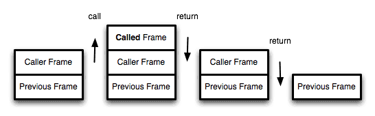
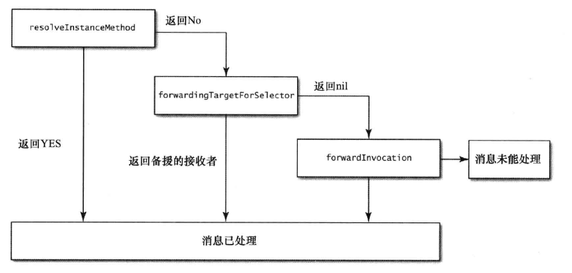
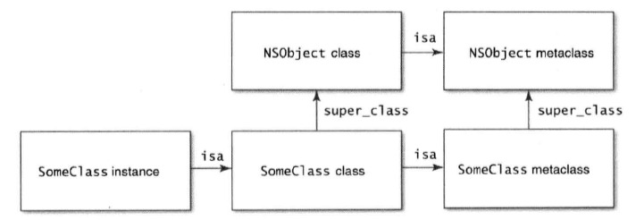

# Effective Objective-C 2.0
## 前言
&emsp;&emsp;本文是对《Effective Objective-C 2.0编写高质量iOS和OSX代码的52个有效方法》这本书的总结和个人学习备忘录，仅供参考，详情可购买电子书或者纸质书。
## 第一章 熟悉Objective-C
### 第一条：了解Objective-C语言的起源
&emsp;&emsp;OC为C的超集，其使用“消息结构”而非“函数调用”，运行时所执行的代码由运行环境来决定，使用函数调用的语言则由编译器决定。
### 第二条：在类的头文件里尽量少引用其他头文件
&emsp;&emsp;引用过多头文件会增加编译时间，如h文件中不需要知道类或协议的具体实现可以使用@class和@protocol让编译器识别该名字。也能解决两个h文件互相引用引起的循环引用问题，虽然用#import不会像#include一样导致死循环，但其中一个文件将无法正确编译。
### 第三条：多用字面量语法，少用与之等价的方法
&emsp;&emsp;OC以语法繁杂著称，使用字面量可以使代码更加简洁，增加代码的易读性。但是除了字符串，字面量所创建的对象必须属于Foundation框架，创建NSArray、NSDictionary和NSNumber子类需要使用非字面量语法，其子类不常见。
### 第四条：多用类型常量，少用#define预处理指令
&emsp;&emsp;例：#define ANIMATION_DURATION 0.3f 该预处理指令会把所有碰到的ANIMATION_DURATION字符串替换成0.3，但此定义没有类型信息，static const NSTimeInterval kAnimationDuration = 0.3f;使用此定义的常量包含类型信息，可以描述常量的含义。  
&emsp;&emsp;变量一定要同时用static和const声明，避免其被修改。如果常量局限于某“编译单元”（通常指某一类的实现文件，即.m），则在命名的时候前面加k，如外部可见，则通常命名前加类名。static修饰意味着该变量仅在当前编译单元可见，如果不加则编译器会为创建一个外部符号，在.h文件用使用extern关键字即可让外部调用，此时常量在全局符号表中。如果同时使用static和const，编译器并不会创建符号，会像#define一样替换变量为常值。
### 第五条：用枚举表示状态、选项、状态码
&emsp;&emsp;每一个状态都用一个便于理解的值来与之对应，其代码更易读易懂。单选使用NS_ENUM，多选使用NS_OPTIONS宏。
## 第二章 对象、消息、运行期
### 第六条：理解“属性”这一概念
&emsp;&emsp;使用属性，编译器会自动帮你生成setter和getter方法，以及一个带下划线的成员变量。在实现文件使用@synthesize关键字可以指定实例变量的名字，在同时重写setter和getter方法时，编译器不会自动帮你生成成员变量，需要使用@synthesize来指定实例变量的名字。使用@dynamic关键字就不会生成成员变量以及存取方法。直接在.h{}里声明成员变量，需要用@public关键字才能使外部调用，而且需要用类似于C++的->来取值，基本数据类型为值拷贝，对象类型为强引用。  
&emsp;&emsp;attribute也会影响属性的存取方法，默认为atomic、readwrite、assign或strong(基本数据类型和对象类型)。
* assign 设置方法只会执行针对“纯量类型”的简单赋值操作。
* strong 该特质定义了一种“拥有关系”，为此属性设置新值时，会保留新值，释放旧值，然后将新值设置上去。如MRC下的赋值：[_oldVlue release]; _oldVlue = [newValue retain];
* weak 该特质定义了一种“非拥有关系”，为此属性设置新值时，不会保留新值也不会释放旧值，但在对象摧毁时，会将属性值清空。
* unsafe_unretained 此特质语义与assign相同，但是assign用来修饰基本数据类型，unsafe_unretained用来修饰对象类型，表达一种“非拥有关系”，对象摧毁时不会清空。
* copy 与strong类似，但设置方法不保留新值，而是copy。在修饰NSSrting时，copy和strong相同，都是对原地址进行强引用，但修饰NSMutableString时，copy会copy出新的一份内存地址，并指向该地址。理论上实现NSCopying协议的对象都可以用copy修饰，赋值时会走copyWithZone方法，但一般用于string，看业务需求。  
&emsp;&emsp;getter=name指定获取方法名，setter=name指定赋值方法名，不常见。  
&emsp;&emsp;如果在声明文件中，使用了readOnly修饰属性，在实现文件可以重写该属性并用readWrite修饰，就可以在实现文件中改写该属性。  
&emsp;&emsp;atomic会通过锁定机制来确保其操作的原子性，但在一个线程多次读取某属性值的过程中有别的线程在修改该值，即使声明atomic也会读取到不同的值，而且使用同步锁的开销大，一般都使用nonatomic。atomic只是在setter和getter中，增加了同步线程锁，保证数据的存取安全，但是(敲黑板)，如果不涉及到setter和getter方法呢，例如对mutableArray的相关操作，atomic并没有用。
### 第七条：在对象内部尽量直接访问实例变量
&emsp;&emsp;读取数据时，直接使用成员变量，写入数据时使用属性。在初始化和dealloc中，应总是通过实例变量来读写数据。懒加载除外。无非就是节省了调用getter的方法的时间。
### 第八条：理解“对象等同性”这一概念
&emsp;&emsp;等同性，即equal，比较两个对象是否相同。NSObject中isEqual的默认实现是，当且仅当其指针值完全相等时，两个对象才相等。当两个对象equal时，hash也必须返回同一个值，但hash返回同一个值，两个对象不一定相等。  
&emsp;&emsp;一般重写对象isEqual方法时，都要重写hash方法，否则就会违反Object.hashCode的通用约定，从而导致该类无法与所有基于散列值（hash）的集合类结合在一起正常运行，这样的集合类包括HashMap（nsdictionary）、HashSet(nsset)、Hashtable(nsarray)。
### 第九条：以“类族模式”隐藏实现细节
&emsp;&emsp;对外开放一个抽象类，例如UIButton，初始化时传入一个Type，相关实现交由子类，隐去实现细节。系统框架中经常使用类族。
### 第十条：在既有类中使用关联对象存放自定义数据
&emsp;&emsp;在开发中偶尔会有在既有类中添加属性的需求，一般做法是生成一个既有类的子类，然后在子类中添加相关属性。但有时候该类是通过某一机制创建的，开发者通过该机制创建子类，这时候就用到了关联对象(AssociatedObject);  
&emsp;&emsp;使用关联对象，需要引入#import <objc/runtime.h>，其主要函数有三个
``` objectivec
设置关联对象    objc_setAssociatedObject(id  _Nonnull object, const void * _Nonnull key, id  _Nullable value, objc_AssociationPolicy policy)
获取关联对象    objc_getAssociatedObject(id  _Nonnull object, const void * _Nonnull key)
删除关联对象    objc_removeAssociatedObjects(id  _Nonnull object)
```
&emsp;&emsp;可以将对象理解成一个dic，使用key来进行存取，object为当前操作的对象，key为泛型的键，一般用静态变量来作为关键字，如：static const char objcKey;然后传入&objcKey即可。也可以用当前方法名作为关键字，如在set方法中传入：@selector(getterMethod)，在getter方法中直接使用_cmd即可。value即需要关联的值，policy有五种：
``` objectivec
typedef OBJC_ENUM(uintptr_t, objc_AssociationPolicy) {
    OBJC_ASSOCIATION_ASSIGN = 0,           /**< Specifies a weak reference to the associated object. */
    OBJC_ASSOCIATION_RETAIN_NONATOMIC = 1, /**< Specifies a strong reference to the associated object. 
                                            *   The association is not made atomically. */
    OBJC_ASSOCIATION_COPY_NONATOMIC = 3,   /**< Specifies that the associated object is copied. 
                                            *   The association is not made atomically. */
    OBJC_ASSOCIATION_RETAIN = 01401,       /**< Specifies a strong reference to the associated object.
                                            *   The association is made atomically. */
    OBJC_ASSOCIATION_COPY = 01403          /**< Specifies that the associated object is copied.
                                            *   The association is made atomically. */
};
```
按需传入即可。
### 第十一条：理解objc_msgSend的作用
&emsp;&emsp;c语言中函数调用使用静态绑定，即编译期就能决定运行时所需调用的函数。例：
``` objectivec
void callType(NSInteger type) {
    if (type == 0) {
        printBye();
    } else {
        printHello();
    }
}

void printHello() {
    printf("hello");
}

void printBye() {
    printf("bye");
}
```
&emsp;&emsp;如果不考虑内联(inline)，编译器在编译器已经知道两个函数，会直接生成调用这些函数的指令，函数地址是硬编码在指令中的。如果改下callType的代码：
``` objectivec
void callType(NSInteger type) {
    void (*fun)(void);
    if (type == 0) {
        fun = printBye;
    } else {
        fun = printHello;
    }
    fun();
}
```
这时就需要使用动态绑定，该例子只有一个函数调用指令，该函数无法硬编码到指令之中，智能在运行时确定。  
&emsp;&emsp;OC中，向对象发送消息，就会使用动态绑定机制来决定需要调用的方法。在底层，所有方法调用，都是c语言函数。在对象收到消息后，该调用哪个方法由运行时决定，甚至可以改变，这些特性使oc成为动态语言。  
```id returnValue = [object messageName:parameter];```  
&emsp;&emsp;object即为消息接受者(receiver)，messageName为选择器(selector)，messageName和parameter一起组成了消息。编译器将其装换为普通的函数调用，就是消息传递的核心函数objc_msgSend。  
```void objc_msgSend(id self, SEL cmd, ...);```  
&emsp;&emsp;编译器会把oc方法转换成以下方法：  
```id returnValue = objc_msgSend(object, @selector(messageName:), parameter);```  
&emsp;&emsp;随后会在当前类的结构体中的方法列表(list of methods)中查找该方法，如果找不到就查找父类的方法列表，直到找到该方法并实现代码。否则就是执行消息转发(message forwarding)操作。  
&emsp;&emsp;第一次调用方法的时比较繁琐，随后objc_msgSend会将匹配结果缓存在快速映射表(fast map)里，每个类都有这一块缓存，之后调用就会快一些。  
* objc_msgSend_stret 如果待发送的消息要返回结构体，可用该函数。当CPU的寄存器容得下该消息返回类型时，该函数才能处理此消息。否则(如结构体太大)，由另一个函数执行派发。此时，那个函数会通过在分配在栈上的变量来处理消息所返回的结构体。
* objc_msgSend_fpret 如果返回的是浮点数，可用该函数。该函数是为了处理X86等架构CPU的奇怪状况。
* objc_msgSendSuper 对父类发送消息。``` objc_msgSendSuper_stret(); objc_msgSend_fp2ret()```也是相同的作用  
&emsp;&emsp;每个对象的方法都相当于一个简单的c函数：```<return_type> Class_selector(id self, SEL _cmd, ...)//真正的函数可能不一样```每个类里都有一张表，来存放函数的指针，并以选择器的名称作为key，所以在方法调用时才能找到对应的执行函数。该函数和objc_msgSend相似，是为了利用“尾调用优化(tail-call)”。
##### 尾调用优化---------start([原文](http://www.ruanyifeng.com/blog/2015/04/tail-call.html))
###### 1、尾调用
就是在某一函数最后调用另一个函数
``` objectivec
function f(x){
  return g(x);
}
```
在函数的最后一步直接返回另一个函数
``` objectivec
// 情况一
function f(x){
  let y = g(x);
  return y;
}

// 情况二
function f(x){
  return g(x) + 1;
}
```
以上两种因为有其他操作，都不属于尾调用
``` objectivec
function f(x) {
  if (x > 0) {
    return m(x)
  }
  return n(x);
}
```
尾调用不一定在函数的尾部，只要是最后一步操作即可。

###### 2.尾调用优化
函数调用会在内存里形成一个“调用记录”，又称“调用帧(call frame)”，保存调用位置和内部变量等信息。
如果在函数A的内部调用函数B，那么在A的调用记录上方就会形成一个B的调用记录，B运行结束之后返回到A，B的调用记录才会消失。如果在B的内部还调用函数C，那就会形成一个C的记录栈，以此类推。所以的调用记录，就形成了一个“调用栈”。
  
尾调用由于是函数的最后一步，所以不需要保留外层函数的调用记录，因为调用位置、变量等信息不会再用到，直接用内部函数的调用记录取代外部函数的调用记录即可。
``` objectivec
function f() {
  let m = 1;
  let n = 2;
  return g(m + n);
}
f();

// 等同于
function f() {
  return g(3);
}
f();

// 等同于
g(3);
```
上述代码中，如果g函数不是尾调用，则需要保留f函数的调用位置以及变量m和n的值等信息。因为调用g之后，f函数已经结束了，所以执行到最后一步就不需要f函数的相关信息，就可以删除掉f函数的调用记录，只保留g函数的调用记录即可。
以上就叫做“尾调用优化(Tail call optimization)”，即只保存内层函数的调用记录。如果所有函数都是尾调用，则每次执行都只有一个内层函数的调用记录，将大大的节省内存。
###### 3.尾递归
函数调用自身称为递归，如果尾调用自身则称为尾递归。
递归函数很耗费内存，因为需要多次调用自身，会形成n个调用记录，而且很容易形成“栈溢出(因为c语言没有没有内置检查机制来保证复制到缓存区的的数据不得大于缓冲区的大小，所以在数据足够大的时候就会形成栈溢出)”。但是尾递归只存在一个调用记录，所以不会发生栈溢出。
``` objectivec
int factorial(int n) {
  if (n == 1) {
    return 1;
  } 
  return n * factorial(n - 1);
}
```
以上为阶乘函数，最多要保存n个调用记录，复杂度为O(n)。
``` objectivec
int factorial(int n) {
  return otherFactorial(n, 1);
}
int otherFactorial(int n, int total) {
    if (n == 1) {
        return total;
    }
    return otherFactorial(n - 1, total * n);
}
```
改成尾递归后，只保留一个调用记录，复杂度为O(1)。
##### 尾调用优化---------end
&emsp;&emsp;在oc调用中，开发者并不需要关心这些，因为底层已经帮你处理好了。  
&emsp;&emsp;消息由接受者(receiver)，选择器(@selector)，以及参数(parameter)构成，发送消息(invoke a message)就是在对象上调用方法(call a method)。  
&emsp;&emsp;对对象发送消息，都要由“动态消息派发系统(dynamic message dispath system)”来处理，找到对应函数并处理。  
### 第十二条：理解消息转发机制
&emsp;&emsp;在对一个对象发送一个它无法识别的消息时，就会启动“消息转发机制”。  
&emsp;&emsp;消息转发分为两阶段，第一阶段先问接收者所属的类，看其是否能动态的添加方法，以处理当前未知的选择器(@selector)，这叫做“动态方法解析(dynamic method resolution)”。第二阶段涉及“完整的消息转发机制”，分为两小步。首先看有没有其他对象能够处理该对象，如果有，则运行期系统会把消息转给该对象，转发过程结束。如果没有“备援的接收者(replacement receiver)”，则启用完整的消息转发机制，运行期系统会把与消息有关的全部细节全部封装到NSInvocation对象，给接收者最后一次机会处理当前消息。
###### 动态方法解析
&emsp;&emsp;对象收到无法解读的消息时，就会走```+ (BOOL)resolveInstanceMethod:(SEL)sel```，如果是类方法，就会走```+ (BOOL)resolveClassMethod:(SEL)sel```.使用该方法的前提是相关的代码实现已经写好，等运行时插入就好，常用来实现@dynamic属性。
``` objectivec
+ (BOOL)resolveInstanceMethod:(SEL)sel

{
    NSString *selName = NSStringFromSelector(sel);
    if ([selName containsString:@"hello"]) {
        class_addMethod(self, sel, (IMP)methodSayHello, "v@:@");
        return YES;
    } else if ([selName containsString:@"bye"]) {
        class_addMethod(self, sel, class_getMethodImplementation(self, @selector(methodSayBye:)), "l@:d");
        return YES;
    }
    return [super resolveInstanceMethod:sel];
}

void methodSayHello(id self, SEL _cmd, id value) {
    printf("\n method say hello %ld \n", [value integerValue]);
}

- (NSInteger)methodSayBye:(double)value
{
    NSLog(@"method say bye--%f", value);
    return (NSInteger)value;
}
```
&emsp;&emsp;以上就是添加方法的相关代码，```class_addMethod(Class _Nullable cls, SEL _Nonnull name, IMP _Nonnull imp, 
const char * _Nullable types) ```，这就是添加方法的函数，cls为添加方法的类，name即方法名，imp为编译器生成指向函数或者方法的指针，types为我们需要的返回值和参数。例：```v@:@```，“v”代表返回值为void，“@”为默认参数self，“:”为默认参数选择器_cmd，最后一个“@”为参数为id类型。常用到的如下：
``` objectivec
c  A char
i  An int
s  A short
l  A long  l is treated as a 32-bit quantity on 64-bit programs.
q  A long long
C  An unsigned char
I  An unsigned int
S  An unsigned short
L  An unsigned long
Q  An unsigned long long
f  A float
d  A double
B  A C++ bool or a C99 _Bool
v  A void
*  A character string (char *)
@  An object (whether statically typed or typed id)
#  A class object (Class)
:  A method selector (SEL)
```
###### 备援接收器
&emsp;&emsp;如果未在上一步为类增加方法，就会进入```- (id)forwardingTargetForSelector:(SEL)aSelector```方法，可以返回一个对象让该对象处理aSelector。此可以模拟“多重继承”的某些特性。
###### 完整的消息转发
&emsp;&emsp;如果以上都未能处理，系统将把所有调用的细节封装成NSInvocation对象，这时候将会调用```- (void)forwardInvocation:(NSInvocation *)anInvocation```方法。
&emsp;&emsp;调用invocation对象之前，将会调用```- (NSMethodSignature *)methodSignatureForSelector:(SEL)aSelector```，需要将所需的返回值和参数等信息传进去，否则将不会调用invocation方法。
``` objectivec
- (NSMethodSignature *)methodSignatureForSelector:(SEL)aSelector
{
    return [NSMethodSignature signatureWithObjCTypes:"v@:@"];
}

- (void)forwardInvocation:(NSInvocation *)anInvocation
{
    [anInvocation setTarget:target];
    [anInvocation setSelector:sel];
    [anInvocation setArgument:argument atIndex:0];
    [anInvocation invoke];
}
```
###### 消息转发全流程
  
&emsp;&emsp;接收者每一步都有机会处理消息，步骤越往后，处理消息的代价越大。如果第一步就处理完消息，就能将方法缓存起来，下次调用的时候不需要走消息转发机制。总而言之，消息处理的越早越好。
### 第十三条：用“方法调配技术”调试“黑盒方法”
&emsp;&emsp;使用一份实现来替换原有的方法实现，这道工序叫做“方法调试”，常用来为已有的方法添加新功能。  
&emsp;&emsp;一般用来调试程序增加日志，不宜滥用。  
&emsp;&emsp;类的方法列表会把选择器的名字映射到方法的实现上，这些方法均以函数指针的形式来表示，称为IMP，原型为：```id (*IMP)(id, SEL, ...)```.  
``` objectivec
+ (void)exchangeMethodForLog
{
    Method baseMethod = class_getInstanceMethod([self class], @selector(uppercaseString));
    Method changeMethod = class_getInstanceMethod([self class], @selector(addLog_uppercaseString));
    method_exchangeImplementations(baseMethod, changeMethod);
}

- (NSString *)addLog_uppercaseString
{
    NSLog(@"add log for uppercase");
    return [self addLog_uppercaseString];
}
```
&emsp;&emsp;这样uppercaseString和addLog_uppercaseString互换了实现，每次调用uppercaseString实际上都会调用addLog_uppercaseString，而调addLog_uppercaseString则会走uppercaseString的实现。所以下面方法并不会死循环。
### 第十四条：理解“类对象”的用意
&emsp;&emsp;每个Objective-C对象实例都是某款内存地址的指针，所以在声明变量时，类型后面需要加一个*。
``` objectivec
/// An opaque type that represents an Objective-C class.
typedef struct objc_class *Class;
/// A pointer to an instance of a class.
typedef struct objc_object *id;
/// Represents an instance of a class.
struct objc_object {
    Class isa  OBJC_ISA_AVAILABILITY;
};
struct objc_class {
    Class isa  OBJC_ISA_AVAILABILITY;   //isa指针，指向metaclass（该类的元类）
#if !__OBJC2__
    Class super_class   //指向objc_class（该类）的super_class（父类）
    const char *name    //objc_class（该类）的类名
    long version        //objc_class（该类）的版本信息，初始化为0，可以通过runtime函数class_setVersion和class_getVersion进行修改和读取
    long info           //一些标识信息，如CLS_CLASS表示objc_class（该类）为普通类。ClS_CLASS表示objc_class（该类）为metaclass（元类）
    long instance_size  //objc_class（该类）的实例变量的大小
    struct objc_ivar_list *ivars    //用于存储每个成员变量的地址
    struct objc_method_list **methodLists   //方法列表，与info标识关联
    struct objc_cache *cache        //指向最近使用的方法的指针，用于提升效率
    struct objc_protocol_list *protocols    //存储objc_class（该类）的一些协议
#endif
} OBJC2_UNAVAILABLE;
```
* Class是一个指向objc_class（类）结构体的指针，而id是一个指向objc_object（对象）结构体的指针。
* objec_object（对象）中isa指针指向的类结构称为objec_class（该对象的类），其中存放着普通成员变量与对象方法 （“-”开头的方法）。
* objec_class（类）中isa指针指向的类结构称为metaclass（该类的元类），其中存放着static类型的成员变量与static类型的方法 （“+”开头的方法）。
如果一个SomeClass对象继承自NSObject，则其继承体系如图所示：  
&emsp;&emsp;super_class指针确定继承关系，isa指针描述实例所属的类。根据布局关系图即可执行“类型信息查询”，对象是否可以响应某个选择器、是否遵守某个协议、对象位于“类继承体系”的哪部分。
###### 在类继承体系中查询类型信息
&emsp;&emsp;可以用类型信息查询方法来检视类继承体系。比如可以用isMemberOfClass判断对象是否是某个特定类的实例，isKindOfClass判断对象是否是某个类或者其子类的实例。  
&emsp;&emsp;比较类是否相同时可以直接用“==”判断，因为类对象为单例。但最好不要直接使用，用类型信息查询可以正确处理那些使用了消息传递机制的对象。比如说某个对象可能把其所有收到的选择器都转发给另一个对象。这样的某个对象叫做“代理（proxy）”，此种对象均以NSProxy作为根类。(NSProxy是一个虚类，用其子类来转发消息的)  
&emsp;&emsp;通常情况下，在此种代理对象(NSProxy的子类)调用class方法获取的是该代理对象本身所属的类，而调用isKindOfClass方法时，因为消息全部被转发到“接受代理的对象”，所有获取的class为“接受代理对象”所属的类，两者会有些不一样。  
* 调用实例方法时，它会首先在自身isa指针指向的objc_class(类)的methodLists中查找该方法，如果找不到则会通过objc_class（类）的super_class指针找到其父类，然后从其methodLists中查找该方法，如果仍然找不到，则继续通过 super_class向上一级父类结构体中查找，直至根class；
* 调用类方法时，它会首先通过自己的isa指针找到metaclass（元类），并从其methodLists中查找该类方法，如果找不到则会通过metaclass（元类）的super_class指针找到父类的metaclass（元类）结构体，然后从methodLists中查找该方法，如果仍然找不到，则继续通过super_class向上一级父类结构体中查 找，直至根metaclass（元类）；
* 运行的时候编译器会将代码转化为objc_msgSend(obj, @selector (selectorName))，在objc_msgSend函数中首先通过obj（对象）的isa指针找到obj（对象）对应的class（类）。在class（类）中先去cache中通过SEL（方法的编号）查找对应method（方法），若cache中未找到，再去methodLists中查找，若methodists中未找到，则去superClass中查找，若能找到，则将method（方法）加入到cache中，以方便下次查找，并通过method（方法）中的函数指针跳转到对应的函数中去执行。  
&emsp;&emsp;正常创建一个子类如图所示，pair的意思就是说，每次创建不单单创建一个CustomString类，还会创建一个元类，CustomString类用来存储实例相关的变量方法协议等，元类就用来存储类变量方法等。
``` objectivec
    id obj = objc_allocateClassPair([NSString class], "CustomString", 0);
    objc_registerClassPair(obj);
```
## 第三章 接口与API设计
&emsp;&emsp;重用代码应当设计成易于复用的形式，需用用到OC中常见的编程范式(paradigm)。
### 第十五条：用前缀避免命名空间冲突
&emsp;&emsp;因为OC没有其他语言内置的命名空间(namespace)机制，所以在命名时要设法避免重名问题，否则编译时就会出错。一般情况下加上公司或者个人的前缀作为区分，需要注意的是，C语言函数名字最好也加上前缀，否则在不同文件中定义了相同名字的函数也会报“重复符号错误”。  
&emsp;&emsp;在自己的开源库中使用第三方库，如果是直接拉进工程中，最好改下把第三方库加上前缀。否则其他人在引用的时候，容易出现错误。如果均使用podspec进行相关依赖的话就会好很多。  
### 第十六条 提供“全能初始化方法”
&emsp;&emsp;为对象提供必要信息，以便其能完成工作的初始化方法叫做“全能初始化(designated initializer)”。  
&emsp;&emsp;如代码所示，所有初始化方法都会调用一个全能初始化方法。这样在底层数据变化时，无需修改其他方法，只需修改全能初始化方法即可。
``` objectivec
- (instancetype)initWithName:(NSString *)name sex:(BOOL)sex age:(NSInteger)age address:(NSString *)address
{
    if (self == [super init]) {
        self.name = name;
        self.sex = sex;
        self.age = age;
        self.address = address;
    }
    return self;
}

- (instancetype)initWithName:(NSString *)name age:(NSInteger)age
{
    return [self initWithName:name sex:YES age:age address:@"hangzhou"];
}

- (instancetype)initWithName:(NSString *)name
{
    return [self initWithName:name age:0];
}
```
### 第十七条 实现description方法
&emsp;&emsp;一般使用NSLog打印对象时，只能打印出对象的类名和指针，并不能直观的看到自己所需的信息，所以可以重写NSObject的description方法，组装并放回自己所需要的数据。比如可以用Dictionary的形式输出，对比数据更加直接。  
&emsp;&emsp;description只是NSLog打印的数据，如果需要在控制台里输出相关的信息，需要重写debugDescription方法，返回所需要的字符串。
### 第十八条 尽量使用不可变对象
&emsp;&emsp;如网络请求回来的状态码，原始数据，外部一般只需要读取，这些数据就可以在h文件里设置成readonly，在m文件里重写成readwrite即可。这样，外部在修改值的时候就会报错。不过，使用kvo或者performSelector可以绕过这层机制，不推荐这么做。  
&emsp;&emsp;一般来说，对外公开的collection(set array dic)，尽量使用不可变的，如果需要修改其中的值，则可提供对应新增或者删除的方法，尽量不要直接操作。
### 第十九条 使用清晰而协调的命名方式
&emsp;&emsp;要遵守OC的命名规范，方法名要言简意赅，要保持与框架相同的风格。点击查看更多代码规范[Google Objective-C Style Guide](http://google.github.io/styleguide/objcguide.html)。  
###### 方法命名
&emsp;1、如果方法的返回值是新创建的，则方法的首单词应为返回值的类型，除非前面还有修饰词，如：localizedString。属性的存取不遵守此原则，一般认为此方法不会创建新对象，即便返回值为内部对象的copy，也认为是其对象本身。如：```+ (NSString *)stringByAppendingString:(nonnull NSString *)string;```  
&emsp;2、需要把表示参数类型的名词放在参数之前。如：```+ (NSString *)stringByAppendingString:(nonnull NSString *)string;```  
&emsp;3、如果方法要在当前对象上进行操作，就应该包含动词；如果执行操作时还需要其他参数，则应该在动词之后加上名词。如：```- (void)insertString:(NSString *)aString atIndex:(NSUInteger)loc;```  
&emsp;4、不要使用str这样的简称，使用全称string  
&emsp;5、BOOL属性最好加上is，以BOOL为返回值的按场景加上is或者has等修饰词  
&emsp;6、get一般用于从调用者本身获取某种数据的场景，如：```- (BOOL)getCString:(char *)buffer maxLength:(NSUInteger)maxBufferCount encoding:(NSStringEncoding)encoding;```  
###### 类与协议的命名
&emsp;&emsp;保持类和协议命名的唯一性，并遵守框架的命名规范。最前面为公司或者个人的前缀，随后为模块的名称，其次为业务名，最后为类型。如：```AHC Scene Log ViewController```
### 第二十条：为私有方法名添加前缀
&emsp;&emsp;用前缀区分私有方法和公有方法可以明了的标识那些方法可用，那些不可用，并可以在有错误的时候方便找出错误的方法。  
&emsp;&emsp;因为OC不能像Java或者C++一样将方法标价为private，所以在命名时可以对私有方法添加前缀以和公共方法做区分，方便修改和调试。如：```- (BOOL)p_isRight;```  
&emsp;&emsp;因为苹果官方私有方法使用单一下划线作为前缀，为了避免方法冲突，开发者需要避免使用单一下划线作为私有方法前缀。
### 第二十一条：理解Objective-C错误模型
&emsp;&emsp;OC中可以用try-catch来捕获异常：  
``` objectivec
    @try {
        NSArray *array = [NSArray array];
        if (array.count == 0) {
            @throw [NSException exceptionWithName:@"ExceptionName" reason:@"The array's count is zero" userInfo:@{}];
        }
    } @catch (NSException *exception) {
        NSLog(@"%@---%@---%@", exception.name, exception.description, exception.userInfo);
    } @finally {
        NSLog(@"finally");
    }
```
&emsp;&emsp;不过比较鸡肋，内存溢出野指针都是UncaughtException类型，能捕获到的都是数组越界、改变不可变对象等代码中轻易可以避免的错误。对于oc思想来说，有错误还不崩溃等着过年呢？嗯，这很OC。This is a joke。。。  
&emsp;&emsp;自动引用计数在默认情况下不是“异常安全的”，throw之后的代码将不会自动释放。可以使用-objc-arc-exceptions打开编译器的标志，用以生成“异常安全”的代码。不过很麻烦，OC中并不常见，一般只用于出现极其错误的问题，就无需考虑恢复，直接抛出异常使程序退出。  
&emsp;&emsp;比如数组越界，如果取出不知名的对象，有可能引发更大的错误，不如直接抛出错误，让开发者从根本上解决问题。  
&emsp;&emsp;所以一般exception只用来处理严重错误（fatal error 致命错误）。对于其他一般错误（nofatal error 非致命错误）时，OC一般另返回值为0或者nil来标识。如对象初始化，当入参不满足条件时即可返回nil表示初始化错误。  
&emsp;&emsp;不过仅靠返回nil不能明了的告诉使用者具体的错误信息，所以可以使用NSError对象，把具体的错误原因返回出去。如：  
``` objectivec
{
    NSError *error = nil;
    NSData *data = [self dataFromFile:&error];
    if (error) {
        
    }
}
- (NSData *)dataFromFile:(NSError **)error
{
    if (/* something wrong */) {
        if (error) {
            *error = [NSError errorWithDomain:NSURLErrorDomain code:NSURLErrorTimedOut userInfo:@@{NSLocalizedDescriptionKey:@"LocalizedDescription"}];
        }
    }
    return nil;
}
```
&emsp;&emsp;使用ARC时，编译器会把(NSError **)转换成(NSError *__autoreleasing *)，指针所指的对象会在方法执行完毕之后自动释放。
### 第二十二条：理解NSCopying协议
&emsp;&emsp;当需要对一个对象使用copy时，需要实现NSCopying协议```- (id)copyWithZone:(nullable NSZone *)zone;```，NSZone不是一个对象，而是使用C结构存储了关于对象的内存管理的信息。之前开发时，会把内存分为不同的区(zone)，对象会创建到对应的区里，防止对象释放时内存过于碎片化。不过现在程序只有一个区(default zone)，apple并不鼓励开发者使用zone，而且绝大部分情况下开发者并不需要关心。所以并不需要关心zone的信息，在方法里生成你想生成的对象并赋值然后返回即可。
``` objectivec
- (id)copyWithZone:(NSZone *)zone
{
    id copyObj = [[self class] allocWithZone:zone];
    /* 对copyObj进行属性赋值等操作 */
    return copyObj;
}
```
&emsp;&emsp;如果需要生成可变的版本，实现```- (id)mutableCopyWithZone:(nullable NSZone *)zone;```即可。[NSArray mutableCopy] => NSMutableArray ，[NSMutableArray copy] => NSArray，NSDictionary也是同理。复制对象时决定使用浅拷贝还是深拷贝，尽量使用浅拷贝。
## 第四章 协议与分类
&emsp;&emsp;OC中的“协议(protocol)”和Java中的“接口(interface)”类似，把某些类应该实现的方法定义在协议文件里，然后实现委托。
&emsp;&emsp;“分类(category)”可以方便的不通过继承为类增加方法，不过也有一些坑需要先理解它来避免。
### 第二十三条：通过委托与数据源协议进行对象间通信
&emsp;&emsp;“委托模式”：对象把对应的行为责任委托给另外一个类，如TableView的delegate中的```- (void)tableView:(UITableView *)tableView didSelectRowAtIndexPath:(NSIndexPath *)indexPath;```，tableView把点击cell事件交予委托者(delegate)处理。
&emsp;&emsp;“数据源模式(Data Source Pattern)”：数据由委托者(dataScource)传入，以获取相关必要参数。如TableView的DataSource中的```- (NSInteger)tableView:(UITableView *)tableView numberOfRowsInSection:(NSInteger)section;```，外部将cell数量告诉tableView以展示。
&emsp;&emsp;不过Apple官方并没有严格的按照此模式，如delegate中的```- (CGFloat)tableView:(UITableView *)tableView heightForRowAtIndexPath:(NSIndexPath *)indexPath;```明显是数据源模式，却放在了delegate协议里。好的学，不好的不要学。。
&emsp;&emsp;在调用代理方法时候，一定要先判断代理是否实现对应方法```[_delegate respondsToSelector:@selector(methodName:)]```，如果有多个方法且会被多次调用，可以使用“位段”对代码进行优化。
``` objectivec
typedef struct {
    unsigned int flagA : 1;
    unsigned int flagB : 1;
}XDelegateFlag;

{
    XDelegateFlag _deleagteFlag;
}
```
&emsp;&emsp;在setDelegate时，用此结构体将对应的responds结果存起来，在调用之前判断结构体的值即可，无需再判断代理是否实现对应方法。

### 第二十四条：将类的实现代码分散到便于管理的数个分类之中
&emsp;&emsp;如果一个类功能庞大，其功能实现全堆放在一个实现文件中，则文件将不可避免的杂乱难以阅读。此时，可以使用分类将该类按功能实现进行拆分，可以方便的开发和定位问题。  
&emsp;&emsp;如NSArray中：
``` objectivec
@interface NSArray<__covariant ObjectType> : NSObject
@interface NSArray<ObjectType> (NSExtendedArray)
@interface NSArray<ObjectType> (NSArrayCreation)
@interface NSArray<ObjectType> (NSDeprecated)
```
&emsp;&emsp;如果在开发公共库时，如调用的方法不希望暴露出去，就可以创建Private分类，供开发者时候，且选择不暴露该文件，即可隐去实现细节。
### 第二十五条：总是为第三方类的分类名称加前缀
&emsp;&emsp;在为既有类添加分类(Category)的时候，分类名及方法名需要加上你的前缀，以免与既有类的方法名相同，否则会覆盖既有类的方法实现，导致很难排查的程序异常。  
&emsp;&emsp;所以在为第三方或者苹果所有类添加分类时候，其名称和方法名都需要加上专用的前缀。
### 第二十六条：勿在分类中声明属性
&emsp;&emsp;在分类中可以声明属性，但并不会生成setter和getter方法及下划线的成员变量。可以在.m文件中声明@dynamic，并手动实现setter及getter方法，用association来存储变量来实现添加属性，但并不推荐使用。  
&emsp;&emsp;所以最好把所用属性都声明在主接口中，分类中只添加方法。
### 第二十七条：使用“call-continuation分类”隐藏实现细节
&emsp;&emsp;“call-continuation分类”即延展：
``` objectivec
@interface ClassName ()
@end
```
&emsp;&emsp;工作中经常使用，用来隐藏私有属性及方法，虽然OC的机制导致私有并不是真正的私有(比如可以用KVO或者performSelector来跳过检测)，但依然有其作用，比如在制作静态的时候可以选择不暴露属性及方法名。这样该类接口文件就会很明了，这样使用者只需关心暴露的属性及方法就可以，隐去实现细节。
&emsp;&emsp;如果一个属性只读，就可以在接口文件定义为readonly，在延展中重新定义为readwrite并修改属性值。如果遵循某个协议，也可以在延展中声明，不需要暴露给外部。
### 第二十八条：通过协议提供匿名对象
&emsp;&emsp;当不希望暴露实现细节或者提供的对象不确定时，可以选择使用id类型的匿名对象。只需定义一个protocol，将外部所用到的实现定义在protocol中，给外部返回一个遵守该协议的id类型对象即可。如：
``` objectivec
- (id <ProtocolName>)methodName:(id)params;
```
&emsp;&emsp;这样返回给外部的即是id类型的匿名对象，虽然也可以在运行时查出该对象，但能在一定程度上隐去具体细节。但使用匿名函数的前提是需要在协议中定义好外部所需要用的属性及方法并由匿名对象实现，如果类型不敏感，即可以使用其来隐藏细节。
## 第五章 内存管理
&emsp;&emsp;在ARC中，OC的内存管理变得尤为简单，几乎所有的内存管理均由编译器来处理了，开发者只需要关注业务相关。但在使用C++对象及block时，需要稍微注意一下，Block需要注意内存管理的原因可以[点击这里](./block.md)来学习一下。
### 第二十九条：理解引用计数
&emsp;&emsp;MRC中需要使用retain、release和autorelease来管理内存，在对象的retainCount为0的时候释放内存。对象创建好之后其引用计数至少为1。但对象的retainCount并不是特别准，苹果官方并不推荐使用，在ARC中苹果官方已经禁止调用retainCount(可以强转成CFTypeRef对象调用CFGetRetainCount来获取引用计数)。因为现在均使用ARC，就不再多讲。
### 第三十条：以ARC简化引用计数
&emsp;&emsp;ARC中的内存已经足够安全，不需要调用MRC中的那些内存管理方法，在ARC中调用那些方法也会编译错误。ARC也是基于引用计数的，引用计数还要执行，不过ARC会帮你执行。它直接调用底层的C语言来管理，比如obj_retain等函数，这样效率更好，节省很多CPU周期。  
&emsp;&emsp;内存管理语义在方法名中已经表现出来，比如方法名以```alloc、new、copy、mutableCopy```开头时，则其返回的对象归调用者所有。意思就是说，返回的对象引用计数必定为正数，在MRC中需要进行release或者autorelease操作。其他情况下，表示返回的对象不归调用者所有，不用对其进行内存管理。如需要额外持有，需要进行retain操作。  
&emsp;&emsp;除了自动调用“保留”与“释放”方法外，使用ARC还有其他好处，它可以执行一些手工操作很难或者无法完成的优化。比如，可以在编译期把能够互相抵消的retain、release、autorelease操作简约。如果发现在同一个对象上执行了多个“保留”和“释放”操作，ARC有时可以成对的移除这个操作。  
&emsp;&emsp;因为向后兼容性，用以兼容不使用ARC的代码。为了优化代码，在方法中返回自动释放的对象时，此时不直接调用对象的autorelease方法，而是调用objc_autoreleaseReturnValue，此函数会检视当前方法返回之后即将执行的那段代码。如果这段代码要在返回的对象上执行retain操作，则设置全局数据结构(此数据结构的具体内容因处理器而异)中的一个标志位，而不执行autorelease操作。与之相似，当需要保留此对象时，此时不直接执行retain，而是改为objc_retainAutoreleaseReturnValue函数。此函数会检测刚才的标志位，若已经置位则不执行retain操作。设置并检测标志位比调用autorelease和retain更快。  
&emsp;&emsp;使用ARC可以减少很多不需要的代码，ARC管理内存的方法基本上就是在合适的地方插入“保留”和“释放操作”。OC中的方法名语义很重要，要注意命名规范。ARC只负责OC对象内存，CoreFoundation对象需要使用(CFRetain/CFRelease)手动管理。
### 第三十一条：在dealloc方法中只释放引用并解除监听
&emsp;&emsp;一般情况下对象释放就会执行dealloc方法，此时可以在dealloc中释放掉使用的CF对象或取消KVO和Notification的订阅。但开销大或系统内稀缺资源不能等到dealloc中再释放，在使用完之后就要及时释放来减少内存开支。dealloc最好不要调用方法，尤其是异步任务，因为此时对象已处于正在回收的状态了。
### 第三十二条：编写“异常安全代码”时留意内存管理问题
&emsp;&emsp;“异常(exception)”这一特性在OC中并不常见，一般有异常就会直接crash。如果使用了异常需要注意内存管理相关问题。  
&emsp;&emsp;在try中的语句发生了异常就会直接执行catch，try中发生异常一下的语句就不会执行。所以在MRC中一定要在finally中释放响应的内存。例：
``` objectivec
NSObject *obj = nil;
@try {
    obj = [[NSObjct alloc] init];
    [obj doSomething];
} @catch(NSException *exception) {
    NSLog(@"Crash!");
} @finally {
    [obj release];
}
```
&emsp;&emsp;在ARC中并不会自动处理内存相关，因为正常情况下就会直接crash，程序分配的内存会被自动回收，再对单个对象进行内存管理意义也不大。但如果需要加上相应的的管理代码，可以使用```-fobjc-arc-exceptions```这个编译器标志来开启此功能。处于Objctive-C++模式时，编译器会自动开启该功能。  
&emsp;&emsp;OC使用Exception的场景不多，一定要注意内存管理。如果项目中使用多个Exception，需要考虑是不是设计有问题，考虑使用NSError。不建议开启处理异常的清理代码，会导致应用程序变大，而且会降低运行效率。
### 第三十三条：以弱引用避免保留环
&emsp;&emsp;OC中使用引用计数来管理内存，但如果对象A持有对象B，而对象B又持有对象A，就会形成保留环，导致A和B的引用计数都无法减少到0，无法正常释放形成内存泄漏。GC(垃圾回收)环境下，系统会检测“孤岛”而释放响应的对象，但iOS从未支持GC，且OS也已经全面使用引用计数。此时就需要使用弱引用，如```unsafe_unretained```来修饰非持有对象。```unsafe_unretained```和```assign```语义相同，不过前者一般修饰对象类型，而后者修饰普通变量。  
&emsp;&emsp;但在开发中，通常使用的是```weak```关键字。它跟```unsafe_unretained```一样都是弱应用，不过```weak```会在对象释放时对```weak```修饰的指针置为nil。原理就是有有一个全局的hash表，CFMutableDictionary对象，以每个对象地址为key，value为CFMutableSet，set中存有该对象所有修饰成weak的对象，对象释放时会从表中找到并将对应的指针置为nil。
### 第三十四条：以“自动释放池”降低内存峰值
&emsp;&emsp;ARC中开发者一般无需关心临时变量的内存，其内存均有ARC在恰当的位置释放，但开发者应该注意的是尽量减少内存的峰值。比如在遍历时，如果循环很长，而且其中会生成无数个autorelease临时变量时，这些临时变量会在下一个事件循环时释放，但之前临时变量就会一直存在导致内存飙升，而结束后内存又会突然下降。  
&emsp;&emsp;一般情况下无需手动创建自动释放池，因为在主线程或者GCD中的子线程，默认都有自动释放池，每次执行事件循环“event loop”时就会将其清空。通常只有在程序的入口需要创建自动释放池，就是在main函数里。
``` objectivec
int main(int argc, char * argv[]) {
	@autoreleasepool {
	    return UIApplicationMain(argc, argv, nil, NSStringFromClass([IMSAppDelegate class]));
	}
}
```
&emsp;&emsp;从技术角度看并不需要该释放池，因为该返回的地方就是程序的终结处，此时操作系统会将程序所占的内存全部释放掉。但是如果不创建该自动释放池，UIApplicationMain函数所创建的临时对象就没有容器可以容纳。所以该释放池可以理解为最外围捕捉全部释放对象的池。  
&emsp;&emsp;自动释放池排布在栈中，对象收到autorelease消息后，系统将其放入最顶端的池里。一般用于遍历中，如果创建了n个autorelease对象，会影响内存峰值。因为正常alloc、new、copy、mutableCopy对象会在作用域之后自动释放，所以不在范围之内。
### 第三十五条：用“僵尸对象”调试内存管理问题
&emsp;&emsp;
>持续更新....